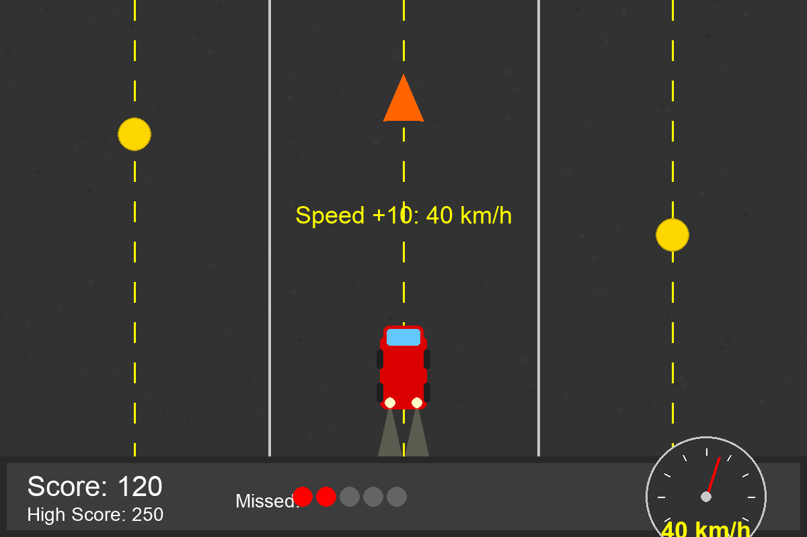

# Speed Hunter

A fast-paced arcade game where you control a car switching between lanes to collect coins while avoiding obstacles.



## Game Description

Speed Hunter is a simple yet addictive arcade game where you control a car that automatically moves forward. Your goal is to collect as many coins as possible by switching between lanes while avoiding obstacles. The game features a progressive difficulty system - for every 10 coins you collect, your car's speed increases by 10 km/h, making the game more challenging as you play.

## Features

- Simple lane-switching gameplay using left and right arrow keys
- Progressive difficulty with speed increasing as you collect coins
- Visual speedometer showing your current speed
- Particle effects for car exhaust, coin collection, and crashes
- Sound effects for engine, coin collection, and crashes
- High score tracking
- Game over after missing 5 coins or hitting an obstacle

## Installation

### Prerequisites

- Python 3.6 or higher
- Pygame 2.0.0 or higher

### Steps

1. Clone the repository:
   ```
   git clone https://github.com/KrishButani/Speed-Hunter-using-Amazon-Q-CLI.git
   ```

2. Install the required dependencies:
   ```
   pip install -r requirements.txt
   ```

3. Run the game:
   ```
   python main.py
   ```

## How to Play

- **Start Game**: Click the "Start Game" button or press ENTER on the main menu
- **Move Left**: Press the LEFT ARROW key
- **Move Right**: Press the RIGHT ARROW key
- **Pause/Menu**: Press ESC during gameplay
- **Restart**: Press R or click "Play Again" after game over
- **Quit**: Press ESC or click "Quit Game"

## Game Mechanics

- **Coins**: Collect coins to increase your score by 10 points
- **Speed**: For every 10 coins collected, your speed increases by 10 km/h
- **Obstacles**: Avoid hitting obstacles, or the game ends
- **Missed Coins**: You can miss up to 5 coins before the game ends

## Project Structure

```
speed_hunter/
│
├── main.py                  # Main game loop and logic
├── car.py                   # Player car class
├── object.py                # Road object logic (collectibles/obstacles)
├── ui.py                    # Display score and high score
├── assets/                  # Game assets
│   ├── car.png
│   ├── road.png
│   ├── coin.png
│   ├── obstacle.png
│   ├── speedometer.png
│   ├── dashboard.png
│   ├── coin.wav
│   ├── crash.wav
│   └── engine.wav
├── highscore.txt            # Persistent high score storage
└── requirements.txt         # Pygame dependency
```

## Customization

You can customize various aspects of the game by modifying the following constants in `main.py`:

- `SCREEN_WIDTH` and `SCREEN_HEIGHT`: Change the game window size
- `LANE_COUNT`: Modify the number of lanes
- `FPS`: Adjust the frame rate

## Troubleshooting

If you encounter any issues:

1. **Game doesn't start**: Make sure you have Python and Pygame installed correctly
2. **No sound**: Check if your system's sound is working properly
3. **Performance issues**: Try reducing the screen size in `main.py`

## Credits

- Game developed by KRISH BUTANI by Amazon Q CLI
- Inspired by classic arcade games


## Contributing

Contributions are welcome! Please feel free to submit a Pull Request.

1. Fork the repository
2. Create your feature branch (`git checkout -b feature/amazing-feature`)
3. Commit your changes (`git commit -m 'Add some amazing feature'`)
4. Push to the branch (`git push origin feature/amazing-feature`)
5. Open a Pull Request
